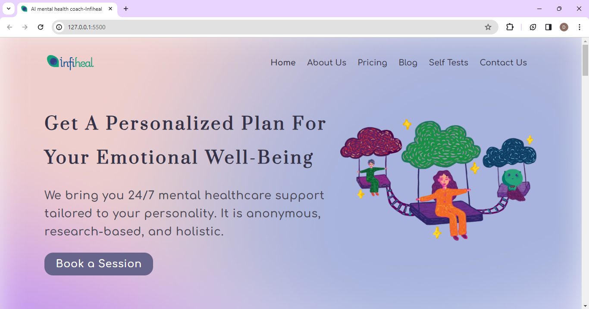
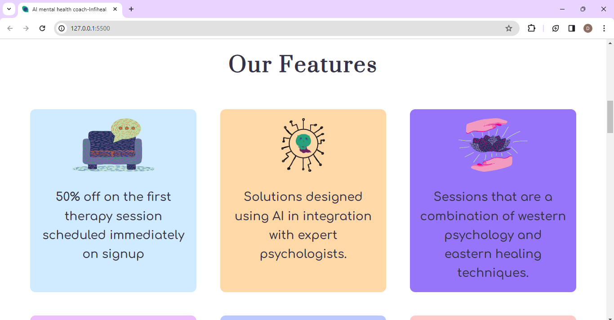
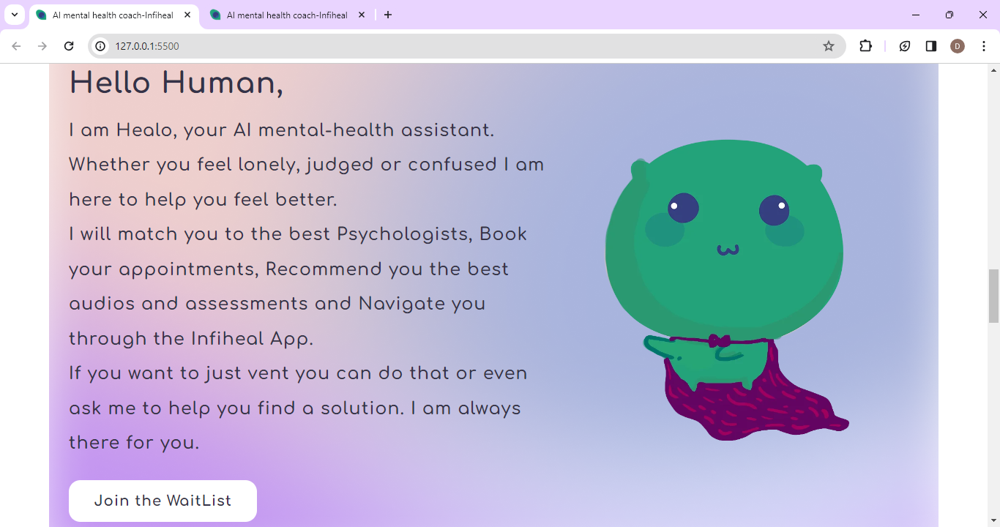
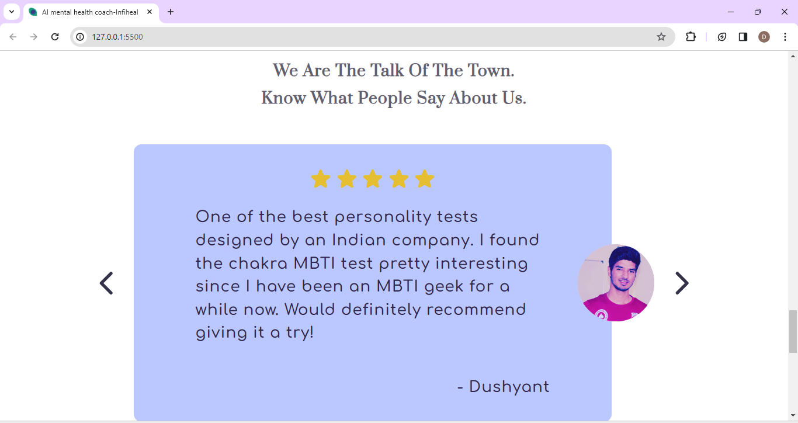

# My First Website Clone: Infiheal

This repository contains my first attempt at creating a website clone, inspired by Infiheal. I built this project using HTML and CSS as part of my learning journey into web development.

## Overview

- **Project Type:** Website Clone
- **Technologies Used:** HTML, CSS
- **Inspiration:** Infiheal

## Features

- Responsive design for various screen sizes.
- Basic layout and styling resembling the Infiheal website.
- Implemented key sections to mimic the original site.

## Learning Goals

- Gain hands-on experience in HTML and CSS.
- Understand the structure and styling of a real-world website.
- Practice creating responsive layouts.

## How to View

1. Clone this repository to your local machine.
2. Open the `index.html` file in your web browser.

## Screenshots

Feel free to explore the code and provide feedback. This project marks the beginning of my web development journey, and I look forward to improving and expanding my skills in future projects.
